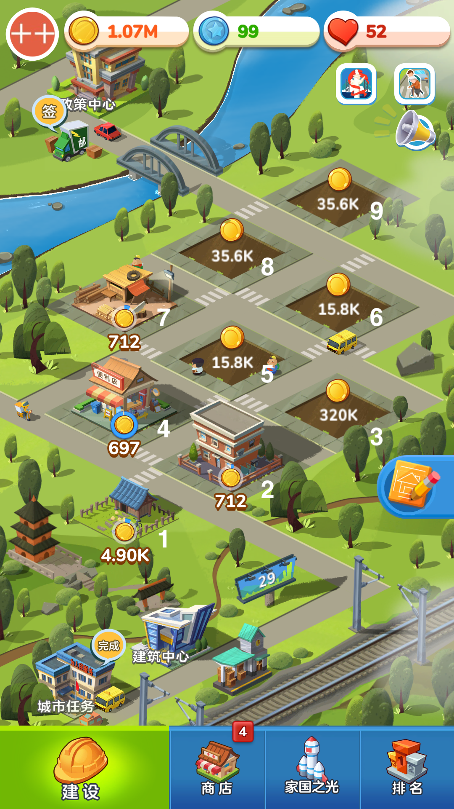
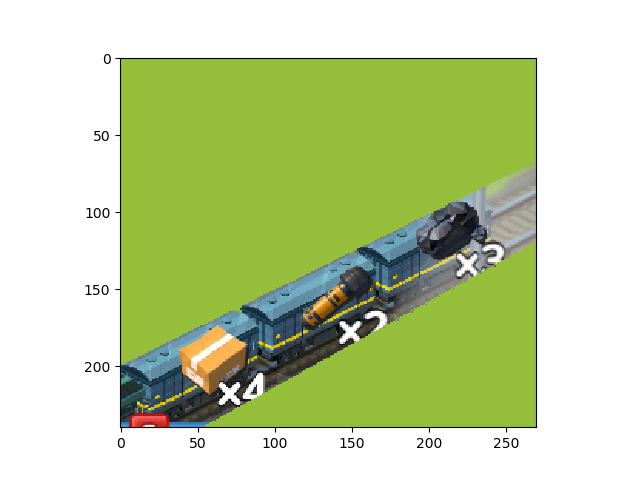
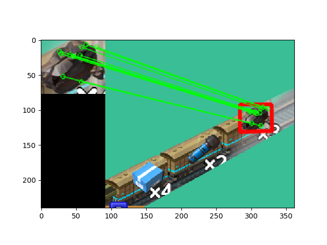

# JGM Automator

* 基于 https://github.com/Jiahonzheng/JGM-Automator 改进
* 基于opencv的特征值匹配 [CSDN博客](https://blog.csdn.net/github_39611196/article/details/81164752)
* 更改搜索逻辑，大幅提高了搜索速度 
* 货物不再要求原分辨率图片，理论上对手机或模拟器分辨率只要求16:9

## 安装与运行

```bash
# 安装依赖
python -m pip install uiautomator2 opencv-python opencv-contrib-python==3.4.2.16

# adb 连接
# 使用 MuMu 模拟器，确保屏幕大小为 1920（长） * 1080（宽）
adb connect 127.0.0.1:7555

# 获取 device 名称,并填写至 main.py
adb devices

# 在已完成 adb 连接后，在手机安装 ATX 应用
python -m uiautomator2 init

# 打开 ATX ，点击“启动 UIAutomator”选项，确保 UIAutomator 是运行的。

# 进入游戏页面，启动自动脚本。
python main.py
```

## 说明

+ 建筑编号




```bash
# 安装依赖
python -m pip install --pre weditor

# 启动 Weditor
python -m weditor
```

+ 货物素材

我们可以自行制作货物的素材：先生成屏幕快照，~~随后在**实际大小**下~~，截取货物图片，保存至 `targets/` 目录下，并在 `target.py` 声明对应的货物种类及其图片路径。

+ 升级列表和收货列表
  在 `main.py`里，定义这两个列表，即可指定要升级的建筑和要收货的建筑
  ```py
   # 升级建筑列表
    up_list = [(2,1),(3,5)] # 2号升级1次， 3号升级5次
    # 收货过滤列表
    harvest_filter = [5,6,7,8] # 只收取5,6,7,8号建筑的货物
  ```

## 实现细节
+ 截图后，分割右下角，并打上遮罩，提高特征值匹配速度，减少错误：
+ 
+ 