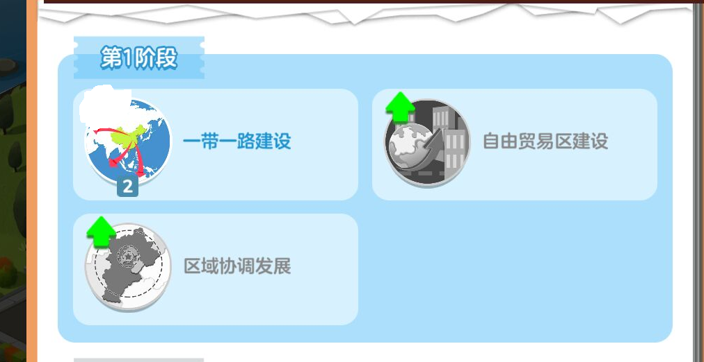
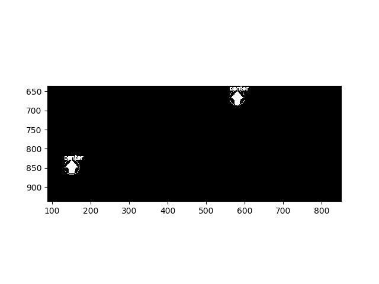
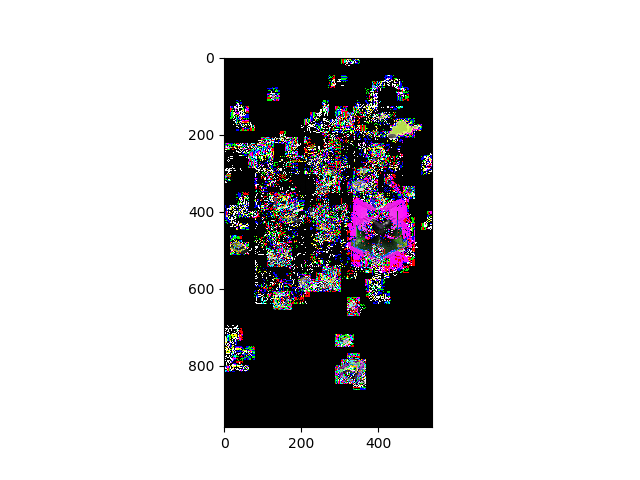

# Simple-JiaGuoMeng-Agent
本项目不限平台, 但是想用模拟器就还是老老实实Win吧

**本项目仅在分辨率大于540x960的16:9的设备下正常工作，其他比例不保证**
## 特点
* 🔥🔥🔥自动升级政策
* 可选自动完成任务
* 自动收货
* 自动收金币
* 自动升级建筑
* 🔥可选自动重启 以加速收火车
* 最初fork自 https://github.com/Jiahonzheng/JGM-Automator 基本上改的面目全非了。。。

* 想只收金色货物的，只要选择收哪些建筑的货就行了，因为金建筑一定是金色货物。
* 本作品的诞生离不开[uiautomator2](https://github.com/openatx/uiautomator2), 一个python封装的安卓自动化测试库，比原生adb shell命令强大得多，方便得多。 
## 安装与运行


+ 如果你没有安装python，请先安装[python3.7.4](https://www.python.org/downloads/release/python-374/)

+ 如果你没有安装adb, 可以使用本项目`adb`文件夹里的adb，只需要把这个文件夹的路径添加到环境变量的`Path`中即可。

+ 以上都安装后，打开`CMD`或者`Powershell`或是其他任何终端，安装如下的依赖：
```bash
# 打开
# 以下是一整行
python -m pip install uiautomator2 opencv-python opencv-contrib-python==3.4.2.16 -i https://pypi.tuna.tsinghua.edu.cn/simple/
```
+ 如果使用 MuMu 模拟器，请先adb连接MuMu
```bash

adb connect 127.0.0.1:7555
```

+ 获取 device 名称,并填写至 main.py. 如果是MuMu则填写`127.0.0.1:7555`
```bash
adb devices
```

+ 在已完成 adb 连接后，在手机安装 ATX 应用
```bash
python -m uiautomator2 init
```

+ 在手机上打开 ATX ，点击`启动 UIAutomator`选项，确保 UIAutomator 是运行的。
+ 如果是mumu浏览器,长时间不运行的话，再次运行前也需要执行这个操作

+ 如何运行：

``` bash
# 在该项目的文件夹根目录打开
python main.py
```


## 说明

+ 建筑编号


+ 升级列表和收货列表
  在 `main.py`里，定义这两个列表，即可指定要升级的建筑和要收货的建筑
  ```py
   # 升级建筑列表
    up_list = [(2,1),(3,5)] # 2号升级1次， 3号升级5次
    # 收货过滤列表
    harvest_filter = [5,6,7,8] # 只收取5,6,7,8号建筑的货物
  ```

## 实现细节

### 政策升级界面为检测绿色箭头实现
* 
* 先分离三个通道二值化，再检测轮廓
* 
### 收火车时，先点按货物，然后检测点按前后绿光差值获取货物目的地：
* 
* 实现这一功能时，若使用原生adb shell实现的话需要多线程或者多进程才行（分别执行按住和截图命令）
在这里由于uiautomator的强大轮子使得的实现这一功能非常方便。

